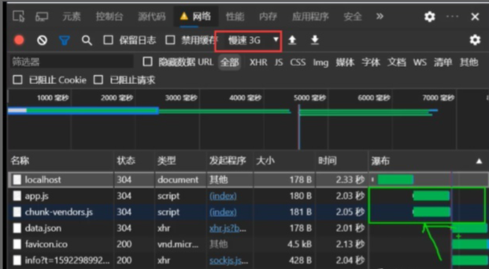
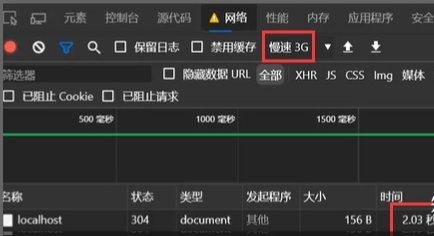

# Next and Nuxt study

## 一、现代化三种渲染的方式

### 1.1 客户端渲染（CSR：Client side rendering）

> 客户端渲染，顾名思义就是只在浏览器上执行的渲染，通过Vue 和 React 构建的单页面应用SPA 都是采用这种方式渲染

#### 1.1.1 渲染步骤

1. 浏览器发起http请求。
2. 服务端响应http请求，返回html文件内容。
3. 浏览器加载html文件中的资源文件（js、css、图片、[音频](https://so.csdn.net/so/search?q=音频&spm=1001.2101.3001.7020)、视频等）。
4. 浏览器渲染并显示页面内容。

#### 1.1.2 优点

- 用户体验好
- 开发效率高
- 渲染性能好
- 可维护性好

#### 1.1.3 缺点

- 由于需要加载js文件以及后台接口数据，所以首屏加载时间会比较长，用户体验不好。
- 由于不能直接在首屏时渲染出页面内容，所以不利于 [SEO](https://link.zhihu.com/?target=https%3A//jingyan.baidu.com/article/c275f6ba2c9c46e33d7567ee.html)

#### 1.1.4 为什么会出现首屏渲染慢？

在使用 Network Slow 3G进行测试，对比 客户端渲染 和 服务端渲染如图分析，当我们输入请求地址 localhost:8080 时，的服务器响应顺序

1. 返回 localhost，空html

2. 加载 localhost中最后引入的 js 脚本，通过加载的瀑布流可以查看是否并行加载

3. 先加载静态数据内容

4. 发送请求，需要加载数据

   

而传统的服务端渲染，直接返回渲染好的 html 给客户端显示, 只需要一个请求，总共就 2s...，如图



### 1.2 服务端渲染（SSR：Server side rendering）

> 服务端渲染就更加直接，在服务器收到http请求的时候，服务器先在自己内部渲染出html的内容，然后直接返回结果。在web1.0时代用的就是CSR。
>
> 即使用传统的 ASP、Java 或 PHP 这种前后端不分离的渲染机制。

#### 1.2.1 渲染步骤

1. 浏览器发起http请求。
2. 服务端响应http请求，先渲染出html的内容，然后返回。
3. 浏览器获取到html的内容并直接渲染。

#### 1.2.2 优点

- 解决SEO问题
- 解决首屏白屏问题

#### 1.2.3 缺点

- 前后端代码完全耦合在一起，不利于开发和维护
- 前端没有足够发挥空间（前端只单纯展示）
- 服务端压力大
- 用户体验一般（每次查看新页面要刷新，而spa不需要刷新）

### 1.3 同构渲染（IR：Isomorphism rendering）

同构渲染 = 后端渲染 + 前端渲染

> 所谓的同构渲染，实际上就是把CSR和SSR的优势结合起来，让同一套代码在服务器上跑一遍，生成首屏内容，然后再在客户端跑一遍，绑定事件。这样既提供了更快的首屏速度、更好的SEO支持，又能避免对服务器带来过大的负载。

#### 1.3.1 渲染步骤

1. 浏览器发起http请求。
2. 服务端响应http请求，渲染出html的内容，然后返回。
3. 浏览器渲染并显示页面内容。
4. 浏览器继续加载html文件中的js文件。
5. 绑定事件，后续路由跳转等行为均交由客户端来渲染。

#### 1.3.2 如何实现同构渲染

- 使用Vue、react等框架的官方解决方案
  - 优点：有助于理解原理
  - 缺点：需要搭建环境，比较麻烦
- 使用第三方解决方案
  - React使用Next.js
  - Vue生态使用Nuxt.js

#### 1.3.3 小结

``` js
同构渲染是将同一套代码先在服务端执行一遍渲染静态页面，然后在客户端执行一遍完成事件绑定。
同构渲染的优势是主要在于两点：1、提高首屏速度，2、更好的SEO支持。
但因为我们不能在服务端渲染期间操作DOM，所以我们的一些代码逻辑需要区分运行环境。
```

#### 1.3.4 拓展

搜索引擎爬虫原理↓↓

``` js
抓取你的url，然后获取你的html源代码并解析。 而你的页面通常用了vue等js的数据绑定机制来展示页面数据，爬虫获取到的html是你的模型页面而不是最终数据的渲染页面。所以spa应用里面爬虫拿到的数据通常是一个#app的空盒子而已。
```

## 二、Next.js实战

### 2.1 介绍

Next.js作为一个同构渲染的框架，它具有同类框架中最佳的“开发人员体验”和许多内置功能。例句如下↓

- 直观的、 [基于页面](https://www.nextjs.cn/docs/basic-features/pages) 的路由系统（并支持 [动态路由](https://www.nextjs.cn/docs/routing/dynamic-routes)）
- [预渲染](https://www.nextjs.cn/docs/basic-features/pages#pre-rendering)。支持在页面级的 [静态生成](https://www.nextjs.cn/docs/basic-features/pages#static-generation-recommended) (SSG) 和 [服务器端渲染](https://www.nextjs.cn/docs/basic-features/pages#server-side-rendering) (SSR)
- 自动代码拆分，提升页面加载速度
- 具有经过优化的预取功能的 [客户端路由](https://www.nextjs.cn/docs/routing/introduction#linking-between-pages)
- [内置 CSS](https://www.nextjs.cn/docs/basic-features/built-in-css-support) 和 [Sass 的支持](https://www.nextjs.cn/docs/basic-features/built-in-css-support#sass-support)，并支持任何 [CSS-in-JS](https://www.nextjs.cn/docs/basic-features/built-in-css-support#css-in-js) 库
- 开发环境支持 [快速刷新](https://www.nextjs.cn/docs/basic-features/fast-refresh)
- 利用 Serverless Functions 及 [API 路由](https://www.nextjs.cn/docs/api-routes/introduction) 构建 API 功能
- 完全可扩展


### 2.2  初始化

#### 2.2.1 创建项目

```bash
npm init -y
yarn add --dev typescript react @types/react react-dom @types/node next axios
```

#### 2.2.2 创建脚本

```json
{
  "scripts": {
    "dev": "next dev",            // 以开发模式启动 Next.js
    "build": "next build",        // 以构建用于生产环境的应用程序
    "start": "next start",        // 以启动 Next.js 生产环境服务器
    "lint": "next lint"           // 以设置 Next.js 的内置 ESLint 配置
  }
}
```

> <font color="#f00">Next.js 是围绕着 [页面（pages）](https://www.nextjs.cn/docs/basic-features/pages) 的概念构造的。一个页面（page）就是一个从 `pages` 目录下的 `.js`、`.jsx`、`.ts` 或 `.tsx` 文件导出的 [React 组件](https://reactjs.org/docs/components-and-props.html)。</font>

#### 2.2.3 创建home组件

```tsx
/*
 * @Descripttion: next.js入门
 * @Author: lukasavage
 * @Date: 2022-06-14 21:02:18
 * @LastEditors: lukasavage
 * @LastEditTime: 2022-06-14 21:07:46
 * @FilePath: \next-and-nuxt\pages\index.tsx
 */
import React from 'react';

type Props = {};

const Home = (props: Props) => {
	return <div>hello, next.js~</div>;
};

export default Home;

```

接着执行`cnpm run dev`,在浏览器打开`http://localhost:3000`就可以跑通项目了~

### 2.3 next.js的基本特性

#### 2.3.1 页面

> 在 Next.js 中，一个 **page（页面）** 就是一个从 `.js`、`jsx`、`.ts` 或 `.tsx` 文件导出（export）的 [React 组件](https://reactjs.org/docs/components-and-props.html) ，这些文件存放在 `pages` 目录下。每个 page（页面）都使用其文件名作为路由（route）。

##### 预渲染

Next.js 具有两种形式的预渲染： **静态生成（Static Generation）** 和 **服务器端渲染（Server-side Rendering）**。这两种方式的不同之处在于为 page（页面）生成 HTML 页面的 **时机** 。

- [**静态生成 （推荐）**](https://www.nextjs.cn/docs/basic-features/pages#static-generation-recommended)：HTML 在 **构建时** 生成，并在每次页面请求（request）时重用。
- [**服务器端渲染**](https://www.nextjs.cn/docs/basic-features/pages#server-side-rendering)：在 **每次页面请求（request）时** 重新生成 HTML。

#### 2.3.2 获取数据

在Next.js中，获取外部数据有两种方式：

1. 您的页面 **内容** 取决于外部数据：使用 `getStaticProps`。
2. 你的页面 **paths（路径）** 取决于外部数据：使用 `getStaticPaths` （通常还要同时使用 `getStaticProps`）。

##### 2.3.2.1 场景1：[页面 **内容** 取决于外部数据](https://www.nextjs.cn/docs/basic-features/pages#场景-1：-页面-内容-取决于外部数据)

要在预渲染时获取此数据，Next.js 允许你从同一文件 `export（导出）` 一个名为 `getStaticProps` 的 `async（异步）` 函数。该函数在构建时被调用，并允许你在预渲染时将获取的数据作为 `props` 参数传递给页面。如下示例👇

```js
function Blog({ posts }) {
  // Render posts...
}

// 此函数在构建时被调用
export async function getStaticProps() {
  // 调用外部 API 获取博文列表
  const res = await fetch('https://.../posts')
  const posts = await res.json()

  // 通过返回 { props: { posts } } 对象，Blog 组件
  // 在构建时将接收到 `posts` 参数
  return {
    props: {
      posts,
    },
  }
}

export default Blog
```

##### 2.3.2.2 场景2：路由传参

```js
function Post({ post }) {
  // Render post...
}

export async function getStaticPaths() {
  // 调用外部 API 获取博文列表
  const res = await fetch('https://.../posts')
  const posts = await res.json()

  // 据博文列表生成所有需要预渲染的路径
  const paths = posts.map((post) => ({
    params: { id: post.id },
  }))

  // We'll pre-render only these paths at build time.
  // { fallback: false } means other routes should 404.
  return { paths, fallback: false }
}

// 在构建时也会被调用
export async function getStaticProps({ params }) {
  // params 包含此片博文的 `id` 信息。
  // 如果路由是 /posts/1，那么 params.id 就是 1
  const res = await fetch(`https://.../posts/${params.id}`)
  const post = await res.json()

  // 通过 props 参数向页面传递博文的数据
  return { props: { post } }
}

export default Post
```

#### 2.3.3 使用CSS

##### 全局CSS

首先创建一个 [`pages/_app.js` 文件](https://www.nextjs.cn/docs/advanced-features/custom-app) （如果不存在的话）。 然后 [`import`](https://developer.mozilla.org/en-US/docs/Web/JavaScript/Reference/Statements/import) 该 `styles.css` 文件。

> pages/_app.js文件，将作为你的layout布局组件，即每个页面都会加载

代码如下👇

```tsx
// pages/_app.js
import './css/index.css'

export default function MyApp({ Component, pageProps }) {
  return <Component {...pageProps} />
}
```

##### 组件级CSS

按照正常的`css module`的方式引入组件即可

```tsx
import styles from './Button.module.css'

export function Button() {
  return (
    ...
  )
}
```


### 2.4 路由

### 2.5 集成koa

> 由于Next自身的服务器只处理在SSR请求，无法处理API接口的请求。因此我们可以通过将next当做一个中间件，集成到我们自己的koa服务器上。

#### 2.5.1 安装依赖

```bash
cnpm i koa koa-router
```

#### 2.5.2 具体实现

1. 在根目录新建一个`client`的文件夹，再创建一个根目录`index.ts`,代码如下↓

   ```tsx
   let Koa = require('koa');
   let Router = require('koa-router');
   const next = require('next');
   const dev = process.env.NODE_ENV !== 'production';
   const app = next({ dev: true });
   const handler = app.getRequestHandler();
   app.prepare().then(() => {
       const server = new Koa();
       let router = new Router();
       server.use(router.routes());
       server.use(async (ctx, next) => {
           await handler(ctx.req, ctx.res);
           ctx.response = false;
       });
       server.listen(3000, () => console.log('server started at port 3000'));
   });
   ```

   

2. 接着修改package.json文件，更改启动项

```json
  "scripts": {
    "client": "nodemon client",
    "build": "next build",
    "start": "next start"
  }
```

